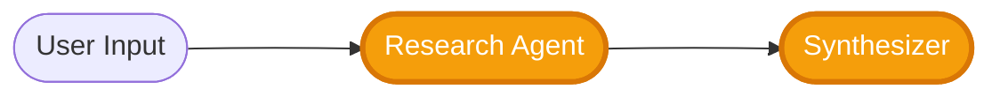
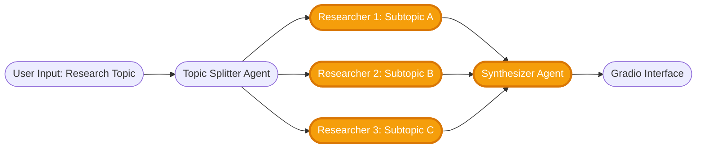

# Welcome to the SuperDataScience Community Project!

Welcome to the **ScholarAI** repository! 🎉

This project is a collaborative initiative brought to you by SuperDataScience, a global learning community focused on data science, machine learning, and AI. Whether you're starting with Generative AI or looking to deepen your skills with agentic AI systems, we're excited to have you on board!

**ScholarAI** is an AI-powered research assistant that uses **web search APIs** and **LLM agents** to find, synthesize, and present academic information in structured reports. You'll learn to build production-ready AI applications using the **OpenAI Agents SDK**, **Tavily/SerpAPI**, and modern deployment tools like **Gradio**.

To contribute to this project, please follow the steps outlined in our [CONTRIBUTING.md](./CONTRIBUTING.md) file.

---

## 🎯 Project Overview

ScholarAI helps users perform research by:

1. **Searching the web** for relevant academic sources, articles, and papers
2. **Extracting and curating** key information using AI agents
3. **Synthesizing findings** into structured, citation-backed reports
4. **Presenting results** through an interactive web interface

### Key Technologies

- **LLM Framework**: OpenAI Agents SDK (or compatible)
- **Search APIs**: [Tavily](https://tavily.com/) or [SerpAPI](https://serpapi.com/)
- **UI Framework**: [Gradio](https://www.gradio.app/) (Streamlit also acceptable)
- **Deployment**: Hugging Face Spaces, Streamlit Cloud, or Docker

---

## 📂 Repository Structure

This project supports two tracks based on experience level:

```
SDS-CP042-scholarai/
├── beginner/                 ← Beginner track files
│   ├── README.md             ← Scope of Works for Beginner Track
│   ├── REPORT.md             ← Markdown template for beginner submissions
│   └── submissions/
│       ├── team-members/
│       └── community-contributions/
│
├── advanced/                 ← Advanced track files
│   ├── README.md             ← Scope of Works for Advanced Track
│   ├── REPORT.md             ← Markdown template for advanced submissions
│   └── submissions/
│       ├── team-members/
│       └── community-contributions/
│
├── CONTRIBUTING.md
├── requirements.txt
└── README.md                 ← You are here!
```

---

## 🟢 Beginner Track — Research → Synthesis

**Perfect for**: Those new to agentic AI and tool-using LLMs

Build a **single-agent pipeline** that:
- Searches the web using Tavily or SerpAPI
- Curates top sources with a Research Agent
- Synthesizes findings into a structured report with citations
- Exports to Markdown/JSON

### Beginner Workflow



### What You'll Learn
- API integration (web search + LLMs)
- Agent tool design and prompting
- Structured output generation
- Building and deploying Gradio apps

📌 **Get started:**  
➡️ [Beginner Track Scope of Works](./beginner/README.md)  
➡️ [Beginner Report Template](./beginner/REPORT.md)  
➡️ [Submit your work](./beginner/submissions/)  

---

## 🔴 Advanced Track — Multi-Agent Research System

**Perfect for**: Those comfortable with AI systems and ready for orchestration challenges

Build a **multi-agent pipeline** where:
- A Topic Splitter breaks research into 2-3 subtopics
- Multiple Researcher Agents work in parallel on different subtopics
- A Synthesizer Agent merges findings and identifies consensus/conflicts
- Optional Critic Agent validates factual consistency

### Advanced Workflow



### What You'll Learn
- Multi-agent orchestration patterns
- Context sharing between agents
- Parallel vs hierarchical agent workflows
- Complex prompt engineering and chain-of-thought
- Advanced synthesis with conflict detection

📌 **Get started:**  
➡️ [Advanced Track Scope of Works](./advanced/README.md)  
➡️ [Advanced Report Template](./advanced/REPORT.md)  
➡️ [Submit your work](./advanced/submissions/)  

---

## 🌍 APIs & Tools

### Required API Keys

You'll need to sign up for:
- **OpenAI**: [platform.openai.com](https://platform.openai.com/) (for GPT models)
- **Search API** (choose one):
  - [Tavily](https://tavily.com/) — AI-optimized search API
  - [SerpAPI](https://serpapi.com/) — Google Search API wrapper

### Development Tools

- **Python 3.9+**
- **OpenAI Agents SDK** or similar agent framework
- **Gradio** or Streamlit for UI
- **Git** for version control

---

## 🗒️ Project Timeline Overview

| Phase                              | Beginner Track Activities                               | Advanced Track Activities                                |
| ---------------------------------- | ------------------------------------------------------- | -------------------------------------------------------- |
| **Week 1: Setup & Foundations**    | Repo setup, API integration, Research Agent            | Topic Splitter, multiple Researcher Agents               |
| **Week 2: Synthesis & Structure**  | Synthesizer Agent, structured reports, exporters        | Multi-agent orchestration, Synthesizer with conflict detection |
| **Week 3: Deployment & Polish**    | Gradio UI, prompt tuning, deployment                    | Advanced UI with per-agent views, deployment             |

---

## 🙌 Contributions & Community

This project is open to both official team members and outside community contributors.

* 🧑‍💻 **Team Members** should submit their work under `team-members/`  
* 🌍 **Community Contributors** are welcome to fork the repo and submit under `community-contributions/`  

See [CONTRIBUTING.md](./CONTRIBUTING.md) for guidelines on how to participate.

---

## 📚 Learning Resources

- [OpenAI Agents SDK Documentation](https://platform.openai.com/docs/assistants/overview)
- [Tavily API Docs](https://docs.tavily.com/)
- [SerpAPI Documentation](https://serpapi.com/docs)
- [Gradio Documentation](https://www.gradio.app/docs)
- [LangChain Agent Guide](https://python.langchain.com/docs/modules/agents/)

---

## 🎓 Get Started!

1. **Choose your track**: Beginner or Advanced
2. **Read the track README**: Understand the scope and deliverables
3. **Set up your environment**: Clone repo, install dependencies, configure API keys
4. **Start building**: Follow the weekly breakdown
5. **Submit your work**: Use the REPORT.md template and submit to the appropriate folder

**Questions?** Open an issue or reach out to the SuperDataScience community!

Happy coding! 🚀